# Campus Flow — Application Flow Documentation

## Table of Contents

1. [System Architecture](#1-system-architecture)
2. [Data Model](#2-data-model)
3. [Authentication & Authorization](#3-authentication--authorization)
4. [Housing Application Workflow](#4-housing-application-workflow)
5. [Renewal Workflow](#5-renewal-workflow)
6. [Maintenance Workflow](#6-maintenance-workflow)
7. [API Endpoints Overview](#7-api-endpoints-overview)

---

## 1. System Architecture

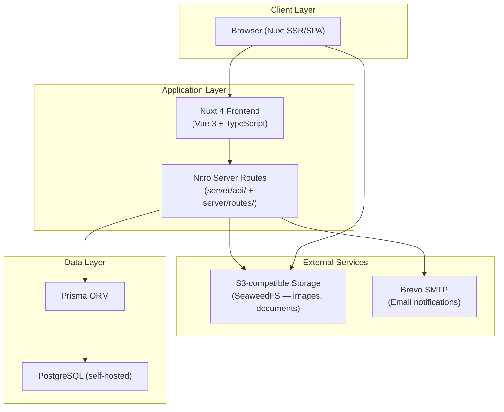

> The browser uploads files **directly to S3** using presigned PUT URLs obtained from Nitro. Nitro never streams file bytes.

---

## 2. Data Model

> All IDs are `String` (UUID v4). Field names follow Prisma camelCase convention.

```mermaid
erDiagram
    User {
        String id PK
        String email
        String role "admin | resident"
        DateTime deletedAt
    }

    UserIdentity {
        String id PK
        String userId FK
        String provider "email | google | ..."
        String providerId
        String password "scrypt hash (email only)"
    }

    Admin {
        String id PK_FK
        String firstName
        String lastName
        String phoneNumber
        String imageUrl
        String role "root | maintenance | renewal | housing_application"
        DateTime deletedAt
    }

    Resident {
        String id PK_FK
        String firstName
        String lastName
        String phoneNumber
        String imageUrl
        String facultyId FK
        String academicSessionId FK
        String lodgmentId FK
        String gender "male | female"
        String origin "national | foreigner"
        String emergencyNumber
        String nic
        DateTime deletedAt
    }

    Faculty {
        String id PK
        String name
        DateTime deletedAt
    }

    AcademicSession {
        String id PK
        DateTime startAt
        DateTime endAt
        DateTime applicationOpenAt
        DateTime applicationCloseAt
        DateTime renewalOpenAt
        DateTime renewalCloseAt
        DateTime deletedAt
    }

    Building {
        String id PK
        String name
        Int floors
        String illustrationUrl
        Int lodgmentsCount
        Int residentsCount
        Int totalCapacity
        Int capacityRemaining
        DateTime deletedAt
    }

    Lodgment {
        String id PK
        String buildingId FK
        Int floor
        Int roomNumber
        Int capacity
        Int residentsCount
        Int capacityRemaining
        DateTime deletedAt
    }

    HousingApplication {
        String id PK
        String firstName
        String lastName
        String phoneNumber
        String imageUrl
        String email
        String gender
        String origin
        String emergencyNumber
        String nic
        String nicUrl
        String schoolCertificateUrl
        String facultyId FK
        String academicSessionId FK
        String lodgmentId FK
        String status "pending | accepted | refused | validated"
        String refusalReason
    }

    Renewal {
        String id PK
        String residentId FK
        String academicSessionId FK
        String facultyId FK
        String phoneNumber
        String emergencyNumber
        String imageUrl
        String nicUrl
        String schoolCertificateUrl
        String status "pending | accepted | refused | validated"
        String refusalReason
    }

    Maintenance {
        String id PK
        String residentId FK
        String lodgmentId FK
        String type "electrical | plumbing | equipment | hvac | other"
        String description
        String status "pending | accepted | done | refused"
        DateTime startAt
        DateTime endAt
    }

    Maintainer {
        String id PK
        String firstName
        String lastName
        String phoneNumber
        String imageUrl
        DateTime deletedAt
    }

    MaintenanceMaintainer {
        String maintenanceId PK_FK
        String maintainerId PK_FK
        DateTime assignedAt
    }

    Announcement {
        String id PK
        String title
        String content
        String illustrationUrl
        String status "draft | published"
        DateTime deletedAt
    }

    AuditLog {
        String id PK
        String actorId
        String action
        String targetTable
        String targetId
        Json metadata
        DateTime createdAt
    }

    User ||--o| Admin : "is"
    User ||--o| Resident : "is"
    User ||--o{ UserIdentity : "authenticated via"
    Faculty ||--o{ Resident : "enrolled in"
    Faculty ||--o{ HousingApplication : "applied for"
    Faculty ||--o{ Renewal : "declared in"
    AcademicSession ||--o{ Resident : "registered in"
    AcademicSession ||--o{ HousingApplication : "for"
    AcademicSession ||--o{ Renewal : "for"
    Building ||--o{ Lodgment : "contains"
    Lodgment ||--o{ Resident : "assigned to"
    Lodgment ||--o{ HousingApplication : "assigned at validation"
    Lodgment ||--o{ Maintenance : "subject of"
    Resident ||--o{ Renewal : "submits"
    Resident ||--o{ Maintenance : "submits"
    Maintenance }o--o{ Maintainer : "assigned to"
    MaintenanceMaintainer }|--|| Maintenance : ""
    MaintenanceMaintainer }|--|| Maintainer : ""
```

---

## 3. Authentication & Authorization

### Login Flow

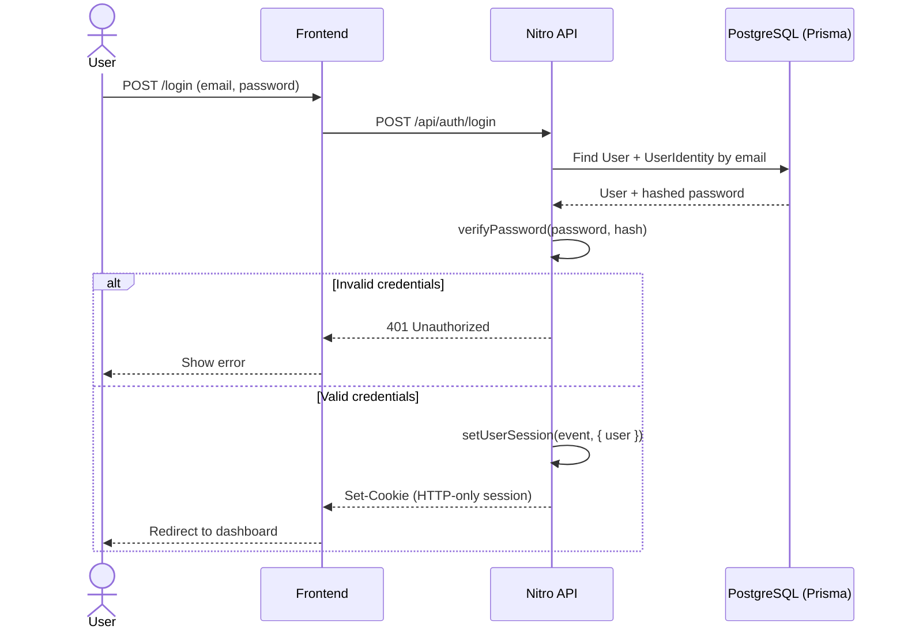

> Sessions are managed by **nuxt-auth-utils** using signed HTTP-only cookies. There are no JWT access tokens or refresh tokens.

### Session Shape

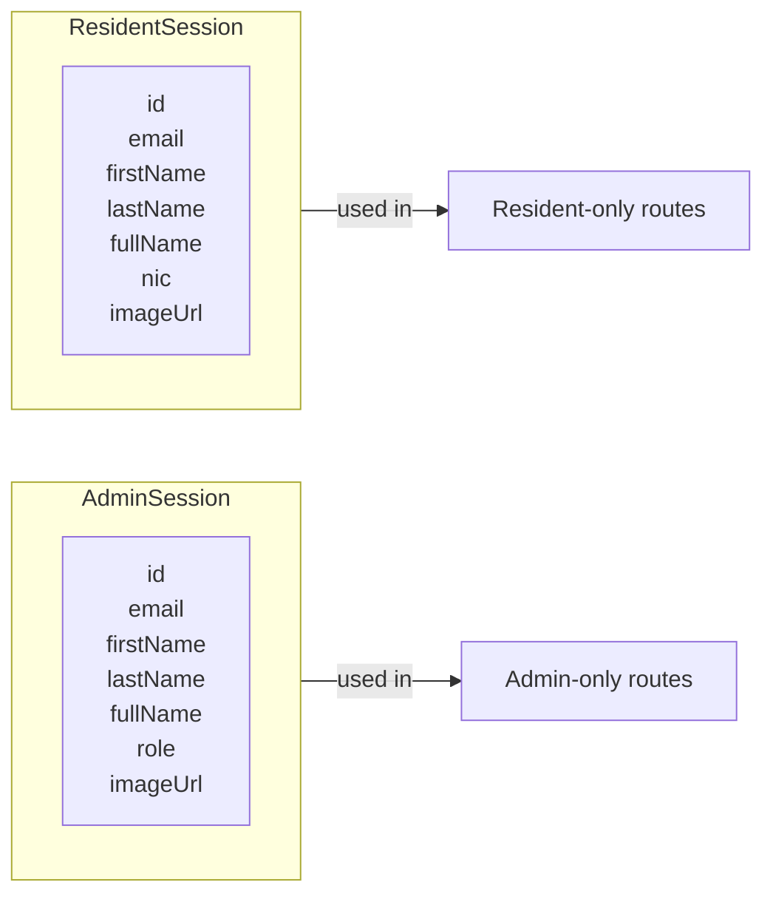

### Role-Based Access Control

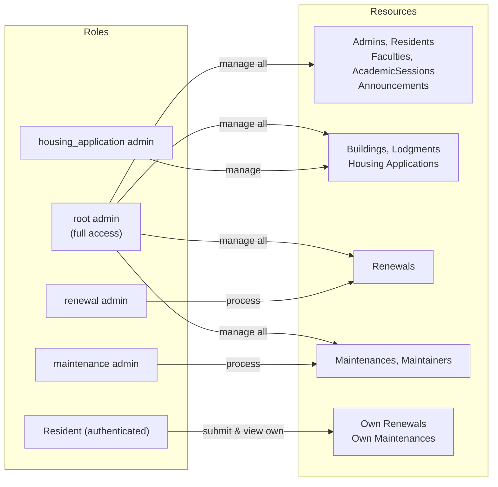

---

## 4. Housing Application Workflow

A **HousingApplication** is submitted by an anonymous visitor via `/join-community`.
On validation an admin assigns a lodgment and the system creates `User + UserIdentity + Resident` records.

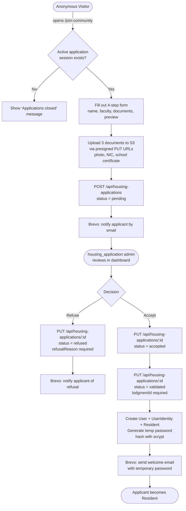

### Status State Machine

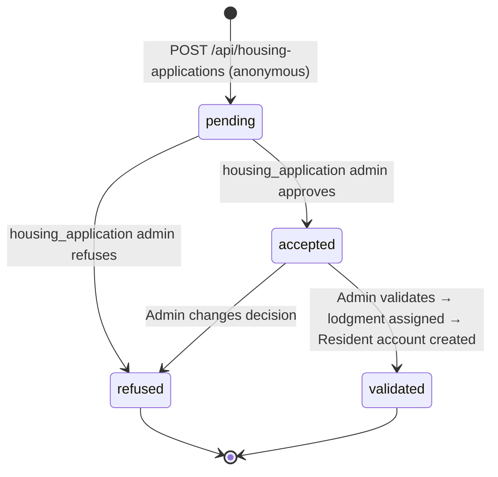

### Refusal Reasons

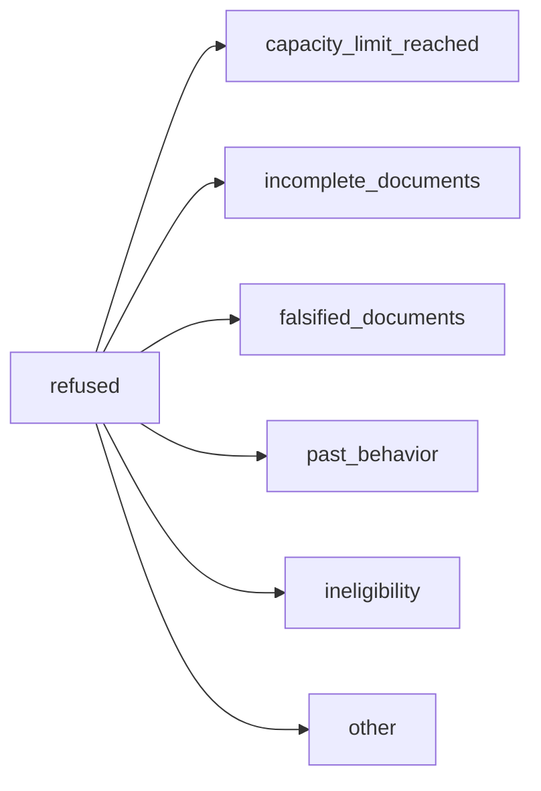

---

## 5. Renewal Workflow

A **Renewal** is submitted annually by an authenticated `Resident` to keep their housing for the next session.

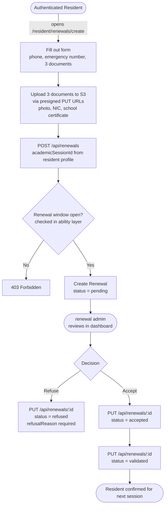

### Status State Machine

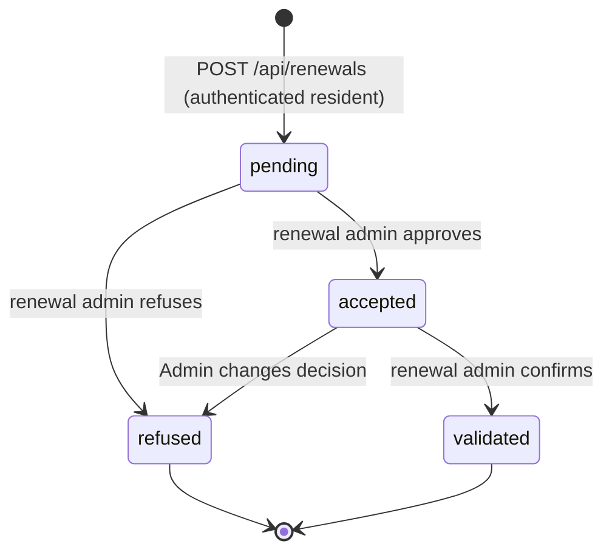

---

## 6. Maintenance Workflow

A **Maintenance** is a repair request submitted by an authenticated `Resident`. The lodgment is auto-resolved from `resident.lodgmentId` — not passed in the request body.

```mermaid
flowchart TD
    A([Authenticated Resident]) -->|opens /resident/maintenances/create| B[Fill out form\ntype, description]
    B --> C[POST /api/maintenances\ntype, description]
    C --> D[Auto-resolve lodgment\nfrom resident.lodgmentId]
    D --> E{Lodgment found?}
    E -- No --> ERR[404 Not Found]
    E -- Yes --> F[Create Maintenance\nstatus = pending\nlodgmentId resolved]

    F --> G([maintenance admin\nreviews in dashboard])
    G --> H{Decision}

    H -->|Refuse| I[PUT /api/maintenances/:id\nstatus = refused]
    H -->|Accept| J[PUT /api/maintenances/:id\nstatus = accepted]
    J --> K[Assign maintainer(s)\nPOST /api/maintenances/:id/maintainers]
    K --> L([External maintainer performs work])
    L --> M[PUT /api/maintenances/:id\nstatus = done]
```

### Status State Machine

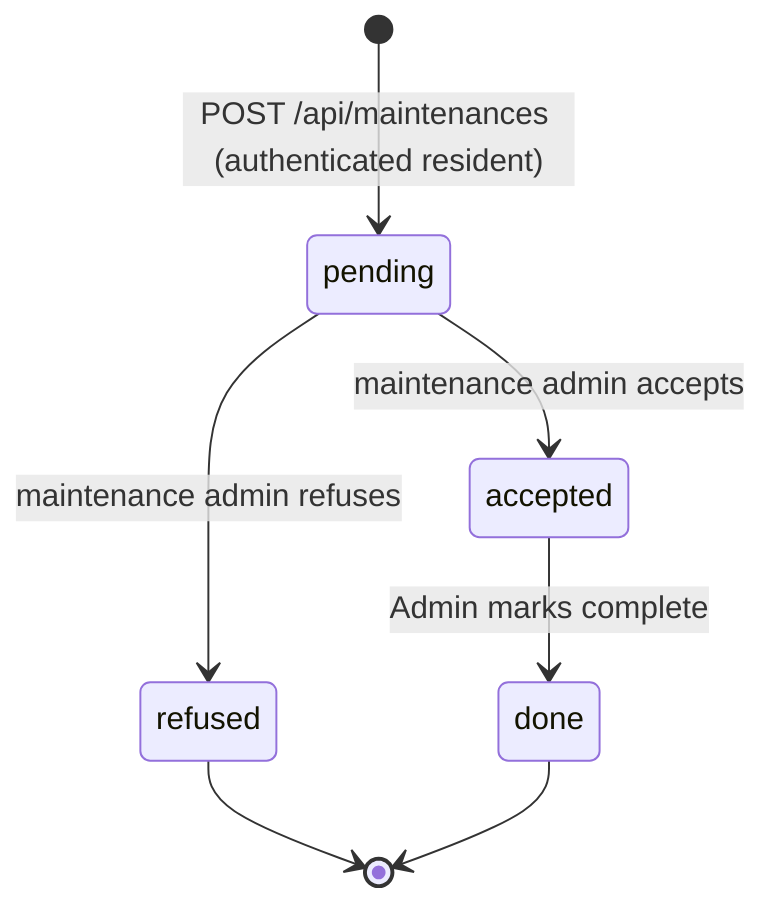

### Maintenance Types

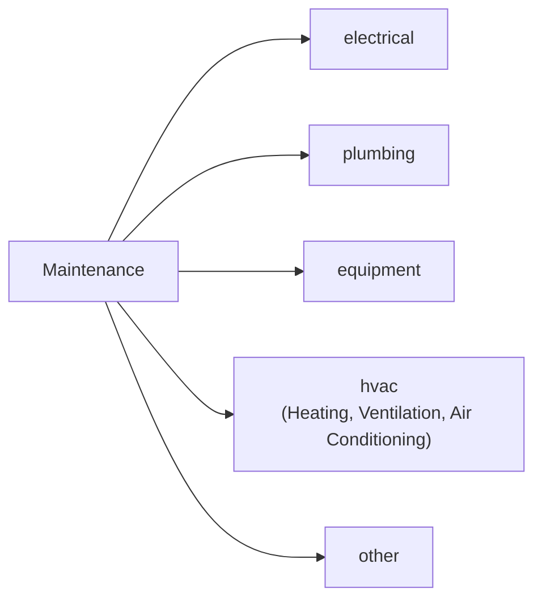

---

## 7. API Endpoints Overview

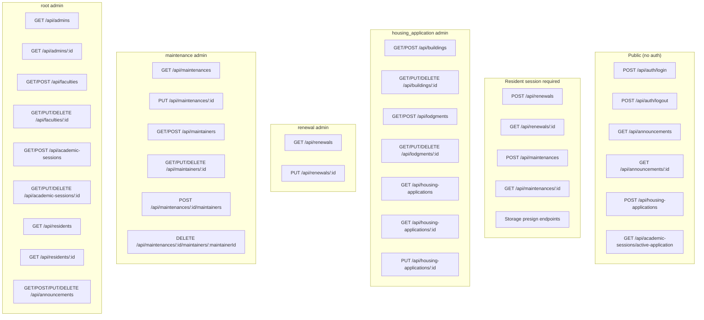
