# Campus Flow — Application Flow Documentation

> Based on the `old/` Nitro.js backend with Prisma + PostgreSQL.

## Table of Contents

1. [System Architecture](#1-system-architecture)
2. [Data Model](#2-data-model)
3. [Authentication & Authorization](#3-authentication--authorization)
4. [Housing Application Workflow](#4-housing-application-workflow)
5. [Renewal Workflow](#5-renewal-workflow)
6. [Maintenance Workflow](#6-maintenance-workflow)
7. [API Endpoints Overview](#7-api-endpoints-overview)

---

## 1. System Architecture

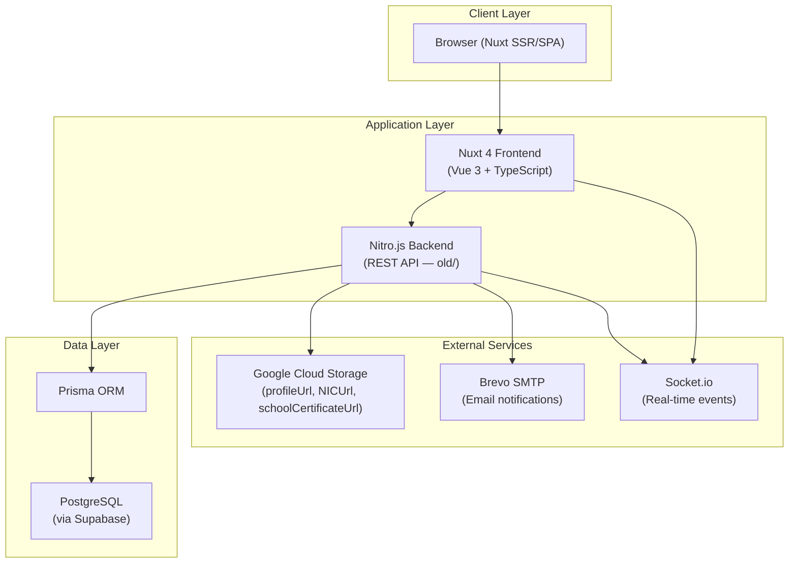
```mermaid
graph TB
    subgraph Client["Client Layer"]
        Browser["Browser (Nuxt SSR/SPA)"]
    end

    subgraph App["Application Layer"]
        Nuxt["Nuxt 4 Frontend\n(Vue 3 + TypeScript)"]
        Nitro["Nitro.js Backend\n(REST API — old/)"]
    end

    subgraph Services["External Services"]
        GCS["Google Cloud Storage\n(profileUrl, NICUrl, schoolCertificateUrl)"]
        Brevo["Brevo SMTP\n(Email notifications)"]
        Socket["Socket.io\n(Real-time events)"]
    end

    subgraph Data["Data Layer"]
        Prisma["Prisma ORM"]
        Postgres["PostgreSQL\n(via Supabase)"]
    end

    Browser --> Nuxt
    Nuxt --> Nitro
    Nitro --> Prisma
    Prisma --> Postgres
    Nitro --> GCS
    Nitro --> Brevo
    Nitro --> Socket
    Nuxt --> Socket
```

---

## 2. Data Model

> All IDs are `Int` (auto-increment). Field names follow Prisma camelCase convention.

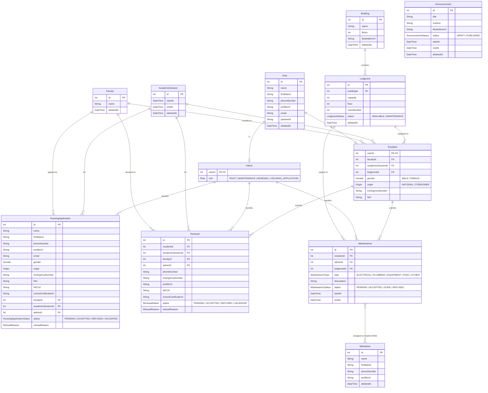
```mermaid
erDiagram
    User {
        Int id PK
        String name
        String firstName
        String phoneNumber
        String profileUrl
        String email
        String password
        DateTime deletedAt
    }

    Admin {
        Int userId PK,FK
        Role role "ROOT | MAINTENANCE | RENEWAL | HOUSING_APPLICATION"
    }

    Resident {
        Int userId PK,FK
        Int facultyId FK
        Int academicSessionId FK
        Int lodgmentId FK
        Gender gender "MALE | FEMALE"
        Origin origin "NATIONAL | FOREIGNER"
        String emergencyNumber
        String NIC
    }

    Faculty {
        Int id PK
        String name
        DateTime deletedAt
    }

    AcademicSession {
        Int id PK
        DateTime startAt
        DateTime endAt
        DateTime deletedAt
    }

    Building {
        Int id PK
        String name
        Int floors
        String illustrationUrl
        DateTime deletedAt
    }

    Lodgment {
        Int id PK
        Int buildingId FK
        Int capacity
        Int floor
        Int roomNumber
        LodgmentStatus status "AVAILABLE | MAINTENANCE"
        DateTime deletedAt
    }

    HousingApplication {
        Int id PK
        String name
        String firstName
        String phoneNumber
        String profileUrl
        String email
        Gender gender
        Origin origin
        String emergencyNumber
        String NIC
        String NICUrl
        String schoolCertificateUrl
        Int facultyId FK
        Int academicSessionId FK
        Int adminId FK
        HousingApplicationStatus status "PENDING | ACCEPTED | REFUSED | VALIDATED"
        RefusalReason refusalReason
    }

    Renewal {
        Int id PK
        Int residentId FK
        Int academicSessionId FK
        Int facultyId FK
        Int adminId FK
        String phoneNumber
        String emergencyNumber
        String profileUrl
        String NICUrl
        String schoolCertificateUrl
        RenewalStatus status "PENDING | ACCEPTED | REFUSED | VALIDATED"
        RefusalReason refusalReason
    }

    Maintenance {
        Int id PK
        Int residentId FK
        Int adminId FK
        Int lodgmentId FK
        MaintenanceType type "ELECTRICAL | PLUMBING | EQUIPMENT | HVAC | OTHER"
        %%  HVAC: Heating, Ventilation, and Air Conditioning
        String description
        MaintenanceStatus status "PENDING | ACCEPTED | DONE | REFUSED"
        DateTime startAt
        DateTime endAt
    }

    Maintainer {
        Int id PK
        String name
        String firstName
        String phoneNumber
        String profileUrl
        DateTime deletedAt
    }

    Announcement {
        Int id PK
        String title
        String content
        String illustrationUrl
        AnnouncementStatus status "DRAFT | PUBLISHED"
        DateTime startAt
        DateTime endAt
        DateTime deletedAt
    }

    User ||--o| Admin : "is"
    User ||--o| Resident : "is"
    Faculty ||--o{ Resident : "enrolled in"
    Faculty ||--o{ HousingApplication : "applied for"
    Faculty ||--o{ Renewal : "declared in"
    AcademicSession ||--o{ Resident : "registered in"
    AcademicSession ||--o{ HousingApplication : "for"
    AcademicSession ||--o{ Renewal : "for"
    Building ||--o{ Lodgment : "contains"
    Lodgment ||--o{ Resident : "assigned to"
    Lodgment ||--o{ Maintenance : "subject of"
    Admin ||--o{ HousingApplication : "handles"
    Admin ||--o{ Renewal : "handles"
    Admin ||--o{ Maintenance : "handles"
    Resident ||--o{ Renewal : "submits"
    Resident ||--o{ Maintenance : "submits"
    Maintenance }o--o{ Maintainer : "assigned to (implicit M2M)"
```

---

## 3. Authentication & Authorization

### Login Flow

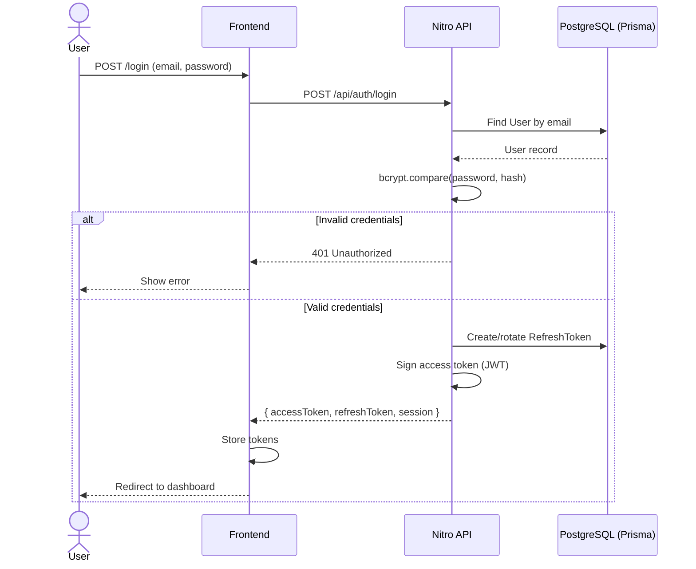
```mermaid
sequenceDiagram
    actor User
    participant Frontend
    participant API as Nitro API
    participant DB as PostgreSQL (Prisma)

    User->>Frontend: POST /login (email, password)
    Frontend->>API: POST /api/auth/login
    API->>DB: Find User by email
    DB-->>API: User record
    API->>API: bcrypt.compare(password, hash)

    alt Invalid credentials
        API-->>Frontend: 401 Unauthorized
        Frontend-->>User: Show error
    else Valid credentials
        API->>DB: Create/rotate RefreshToken
        API->>API: Sign access token (JWT)
        API-->>Frontend: { accessToken, refreshToken, session }
        Frontend->>Frontend: Store tokens
        Frontend-->>User: Redirect to dashboard
    end
```

### Session Types

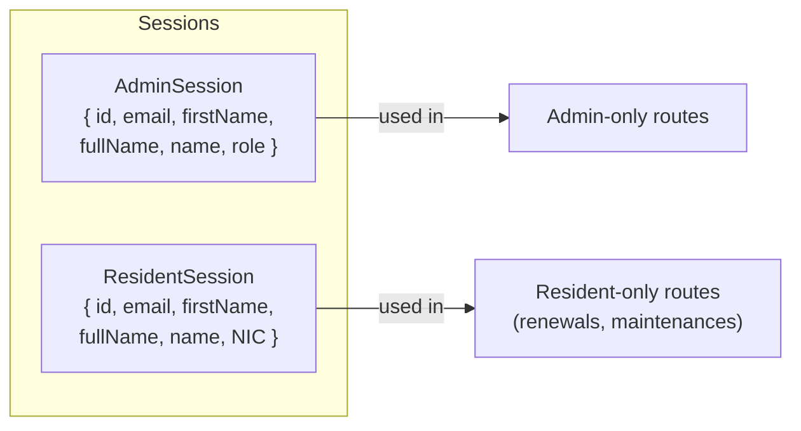
```mermaid
graph LR
    subgraph Sessions
        AS["AdminSession\n{ id, email, firstName,\n  fullName, name, role }"]
        RS["ResidentSession\n{ id, email, firstName,\n  fullName, name, NIC }"]
    end

    AS -->|used in| AdminRoutes["Admin-only routes"]
    RS -->|used in| ResidentRoutes["Resident-only routes\n(renewals, maintenances)"]
```

### Role-Based Access Control

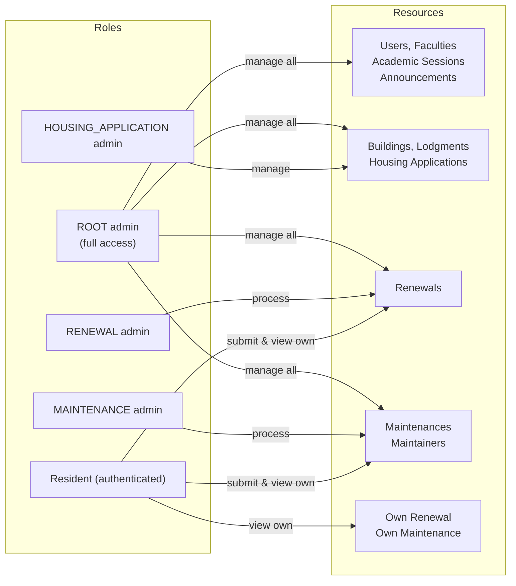
```mermaid
graph LR
    subgraph Roles
        Root["ROOT admin\n(full access)"]
        HousingApplication["HOUSING_APPLICATION admin"]
        Renewal["RENEWAL admin"]
        Maintenance["MAINTENANCE admin"]
        Resident["Resident (authenticated)"]
    end

    subgraph Resources
        CoreManagement["Users, Faculties\nAcademic Sessions\nAnnouncements"]
        BuildingsLodgments["Buildings, Lodgments\nHousing Applications"]
        Renewals["Renewals"]
        Maintenances["Maintenances\nMaintainers"]
        OwnData["Own Renewal\nOwn Maintenance"]
    end

    Root -->|manage all| CoreManagement
    Root -->|manage all| BuildingsLodgments
    Root -->|manage all| Renewals
    Root -->|manage all| Maintenances

    HousingApplication -->|manage| BuildingsLodgments

    Renewal -->|process| Renewals

    Maintenance -->|process| Maintenances

    Resident -->|submit & view own| Renewals
    Resident -->|submit & view own| Maintenances
    Resident -->|view own| OwnData
```

---

## 4. Housing Application Workflow

A **HousingApplication** is a housing application submitted by a prospective resident (no account needed).
On validation, the system creates a `User` + `Resident` record, granting the applicant access.

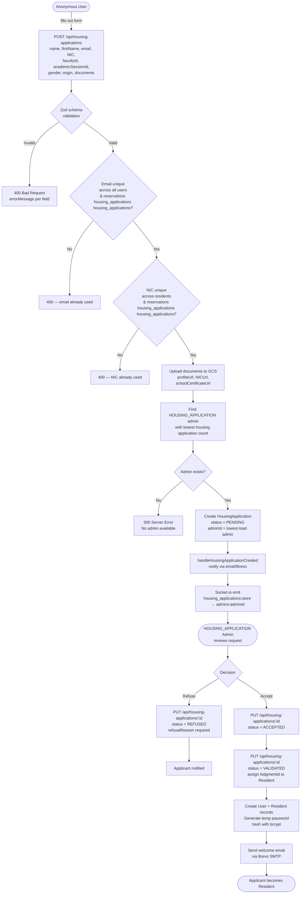
```mermaid
flowchart TD
    A([Anonymous User]) -->|fills out form| B["POST /api/housing-applications\nname, firstName, email, NIC,\nfacultyId, academicSessionId,\ngender, origin, documents"]

    B --> C{Zod schema\nvalidation}
    C -- Invalid --> ERR1[400 Bad Request\nerrorMessage per field]

    C -- Valid --> D{Email unique\nacross all users\n& reservations housing_applications housing_applications?}
    D -- No --> ERR2[400 — email already used]

    D -- Yes --> E{NIC unique\nacross residents\n& reservations housing_applications housing_applications?}
    E -- No --> ERR3[400 — NIC already used]

    E -- Yes --> F[Upload documents to GCS\nprofileUrl, NICUrl,\nschoolCertificateUrl]
    F --> G[Find HOUSING_APPLICATION admin\nwith lowest housing application count]
    G --> H{Admin exists?}
    H -- No --> ERR4[500 Server Error\nNo admin available]

    H -- Yes --> I[Create HousingApplication\nstatus = PENDING\nadminId = lowest-load admin]
    I --> J[handleHousingApplicationCreated\nnotify via email/Brevo]
    J --> K[Socket.io emit\nhousing_applications:store → admins:adminId]

    K --> L([HOUSING_APPLICATION Admin\nreviews request])
    L --> M{Decision}

    M -->|Refuse| N["PUT /api/housing-applications/:id\nstatus = REFUSED\nrefusalReason required"]
    N --> O[Applicant notified]

    M -->|Accept| P["PUT /api/housing-applications/:id\nstatus = ACCEPTED"]
    P --> Q["PUT /api/housing-applications/:id\nstatus = VALIDATED\nassign lodgmentId to Resident"]
    Q --> R[Create User + Resident records\nGenerate temp password\nhash with bcrypt]
    R --> S[Send welcome email\nvia Brevo SMTP]
    S --> T([Applicant becomes Resident])
```

### HousingApplication Status State Machine

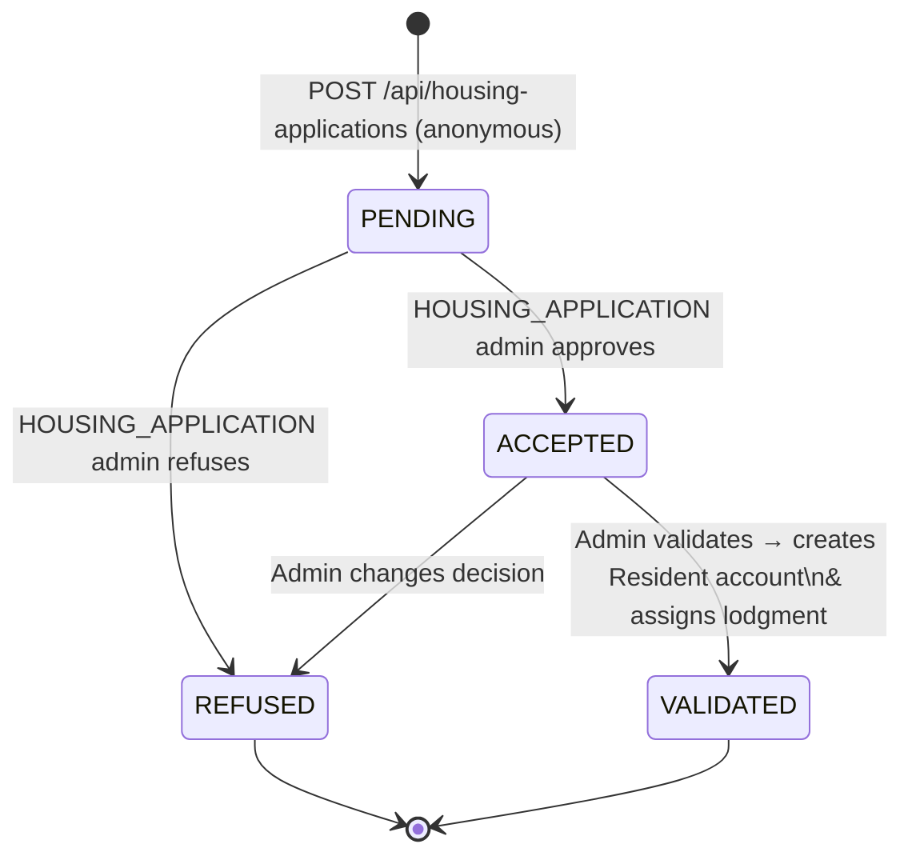
```mermaid
stateDiagram-v2
    [*] --> PENDING : POST /api/housing-applications (anonymous)
    PENDING --> ACCEPTED : HOUSING_APPLICATION admin approves
    PENDING --> REFUSED : HOUSING_APPLICATION admin refuses
    ACCEPTED --> VALIDATED : Admin validates → creates Resident account\n& assigns lodgment
    ACCEPTED --> REFUSED : Admin changes decision
    REFUSED --> [*]
    VALIDATED --> [*]
```

### Refusal Reasons

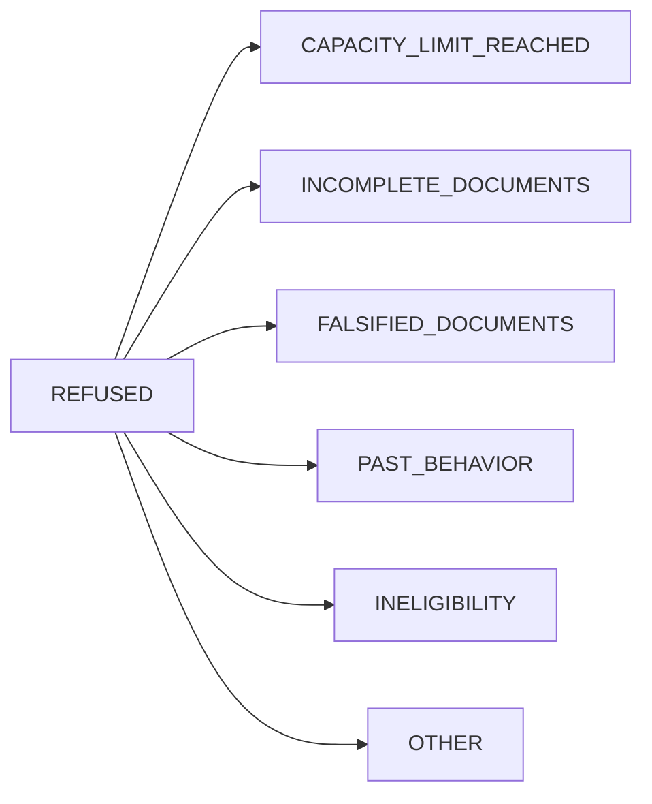
```mermaid
graph LR
    REFUSED --> R1[CAPACITY_LIMIT_REACHED]
    REFUSED --> R2[INCOMPLETE_DOCUMENTS]
    REFUSED --> R3[FALSIFIED_DOCUMENTS]
    REFUSED --> R4[PAST_BEHAVIOR]
    REFUSED --> R5[INELIGIBILITY]
    REFUSED --> R6[OTHER]
```

---

## 5. Renewal Workflow

A **Renewal** is an annual re-application submitted by an authenticated `Resident` to keep housing.

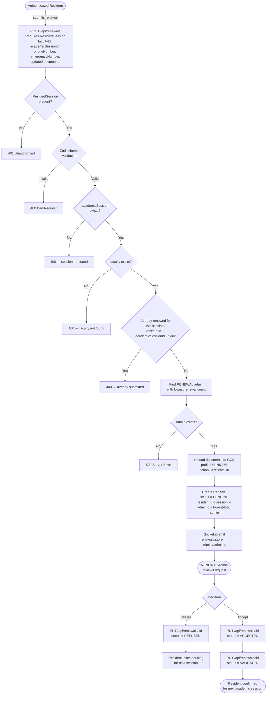
```mermaid
flowchart TD
    A([Authenticated Resident]) -->|submits renewal| B["POST /api/renewals\nRequires ResidentSession\nfacultyId, academicSessionId,\nphoneNumber, emergencyNumber,\nupdated documents"]

    B --> C{ResidentSession\npresent?}
    C -- No --> ERR0[401 Unauthorized]

    C -- Yes --> D{Zod schema\nvalidation}
    D -- Invalid --> ERR1[400 Bad Request]

    D -- Valid --> E{academicSession\nexists?}
    E -- No --> ERR2[400 — session not found]

    E -- Yes --> F{faculty exists?}
    F -- No --> ERR3[400 — faculty not found]

    F -- Yes --> G{Already renewed for\nthis session?\nresidentId + academicSessionId unique}
    G -- Yes --> ERR4[400 — already submitted]

    G -- No --> H[Find RENEWAL admin\nwith lowest renewal count]
    H --> I{Admin exists?}
    I -- No --> ERR5[500 Server Error]

    I -- Yes --> J[Upload documents to GCS\nprofileUrl, NICUrl,\nschoolCertificateUrl]
    J --> K[Create Renewal\nstatus = PENDING\nresidentId = session.id\nadminId = lowest-load admin]
    K --> L[Socket.io emit\nrenewals:store → admins:adminId]

    L --> M([RENEWAL Admin\nreviews request])
    M --> N{Decision}

    N -->|Refuse| O["PUT /api/renewals/:id\nstatus = REFUSED"]
    O --> P[Resident loses housing\nfor next session]

    N -->|Accept| Q["PUT /api/renewals/:id\nstatus = ACCEPTED"]
    Q --> R["PUT /api/renewals/:id\nstatus = VALIDATED"]
    R --> S([Resident confirmed\nfor next academic session])
```

### Renewal Status State Machine

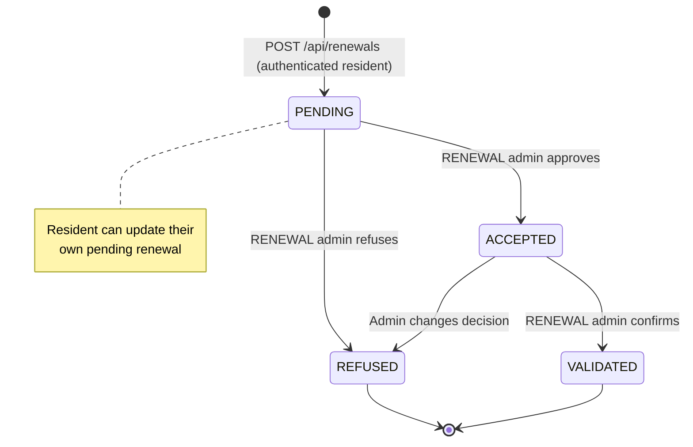
```mermaid
stateDiagram-v2
    [*] --> PENDING : POST /api/renewals (authenticated resident)
    PENDING --> ACCEPTED : RENEWAL admin approves
    PENDING --> REFUSED : RENEWAL admin refuses
    ACCEPTED --> VALIDATED : RENEWAL admin confirms
    ACCEPTED --> REFUSED : Admin changes decision
    REFUSED --> [*]
    VALIDATED --> [*]

    note right of PENDING
        Resident can update their
        own pending renewal
    end note
```

---

## 6. Maintenance Workflow

A **Maintenance** is a repair request submitted by an authenticated `Resident` for their lodgment.
The lodgment is auto-resolved from the resident's `lodgmentId` — not passed in the request body.

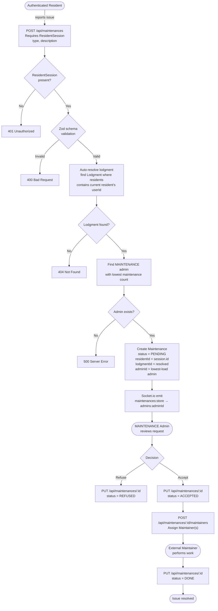
```mermaid
flowchart TD
    A([Authenticated Resident]) -->|reports issue| B["POST /api/maintenances\nRequires ResidentSession\ntype, description"]

    B --> C{ResidentSession\npresent?}
    C -- No --> ERR0[401 Unauthorized]

    C -- Yes --> D{Zod schema\nvalidation}
    D -- Invalid --> ERR1[400 Bad Request]

    D -- Valid --> E["Auto-resolve lodgment\nfind Lodgment where residents\ncontains current resident's userId"]
    E --> F{Lodgment found?}
    F -- No --> ERR2[404 Not Found]

    F -- Yes --> G[Find MAINTENANCE admin\nwith lowest maintenance count]
    G --> H{Admin exists?}
    H -- No --> ERR3[500 Server Error]

    H -- Yes --> I[Create Maintenance\nstatus = PENDING\nresidentId = session.id\nlodgmentId = resolved\nadminId = lowest-load admin]
    I --> J[Socket.io emit\nmaintenances:store → admins:adminId]

    J --> K([MAINTENANCE Admin\nreviews request])
    K --> L{Decision}

    L -->|Refuse| M["PUT /api/maintenances/:id\nstatus = REFUSED"]

    L -->|Accept| N["PUT /api/maintenances/:id\nstatus = ACCEPTED"]
    N --> O["POST /api/maintenances/:id/maintainers\nAssign Maintainer(s)"]
    O --> P([External Maintainer\nperforms work])
    P --> Q["PUT /api/maintenances/:id\nstatus = DONE"]
    Q --> R([Issue resolved])
```

### Maintenance Status State Machine

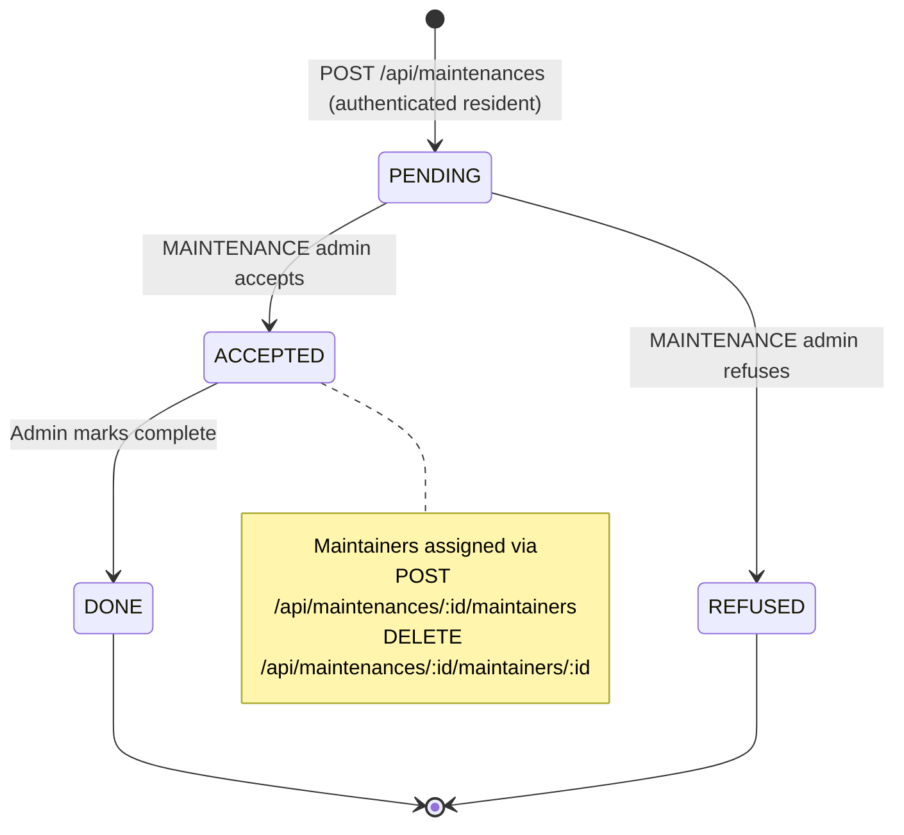
```mermaid
stateDiagram-v2
    [*] --> PENDING : POST /api/maintenances (authenticated resident)
    PENDING --> ACCEPTED : MAINTENANCE admin accepts
    PENDING --> REFUSED : MAINTENANCE admin refuses
    ACCEPTED --> DONE : Admin marks complete
    REFUSED --> [*]
    DONE --> [*]

    note right of ACCEPTED
        Maintainers assigned via
        POST /api/maintenances/:id/maintainers
        DELETE /api/maintenances/:id/maintainers/:id
    end note
```

### Maintenance Types

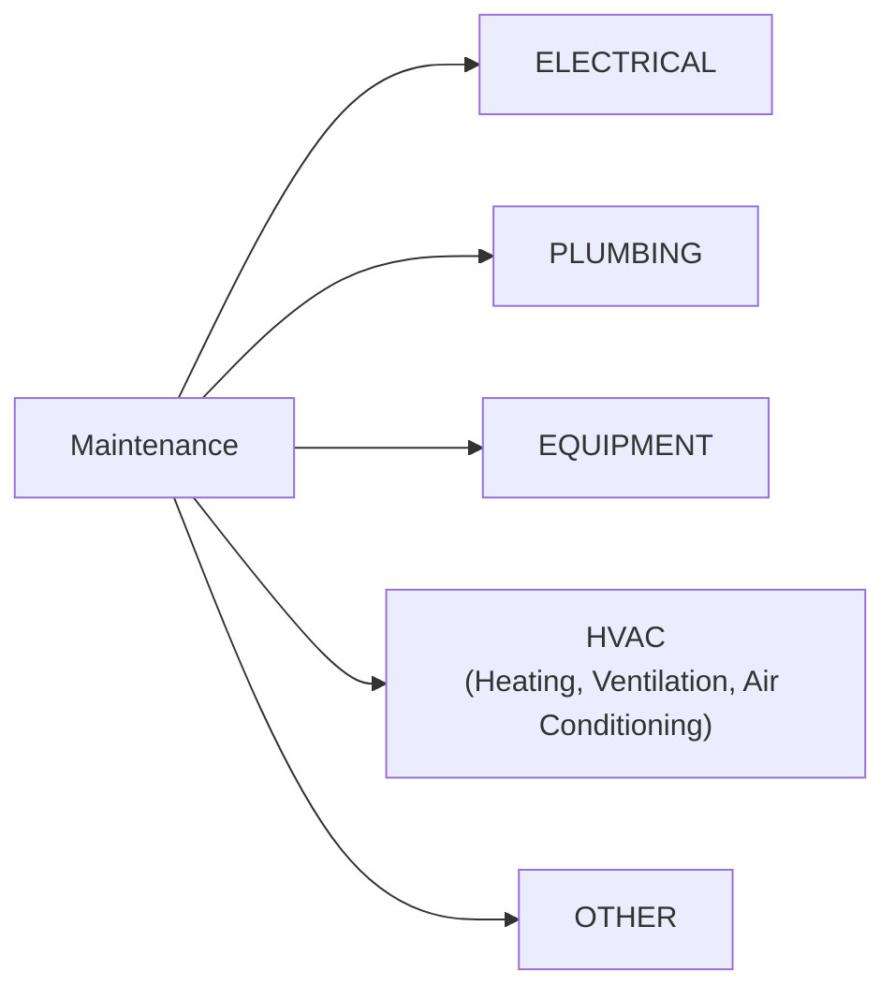
```mermaid
graph LR
    Maintenance --> T1[ELECTRICAL]
    Maintenance --> T2[PLUMBING]
    Maintenance --> T3[EQUIPMENT]
    Maintenance --> T4["HVAC\n(Heating, Ventilation, Air Conditioning)"]
    Maintenance --> T5[OTHER]
```

---

## 7. API Endpoints Overview

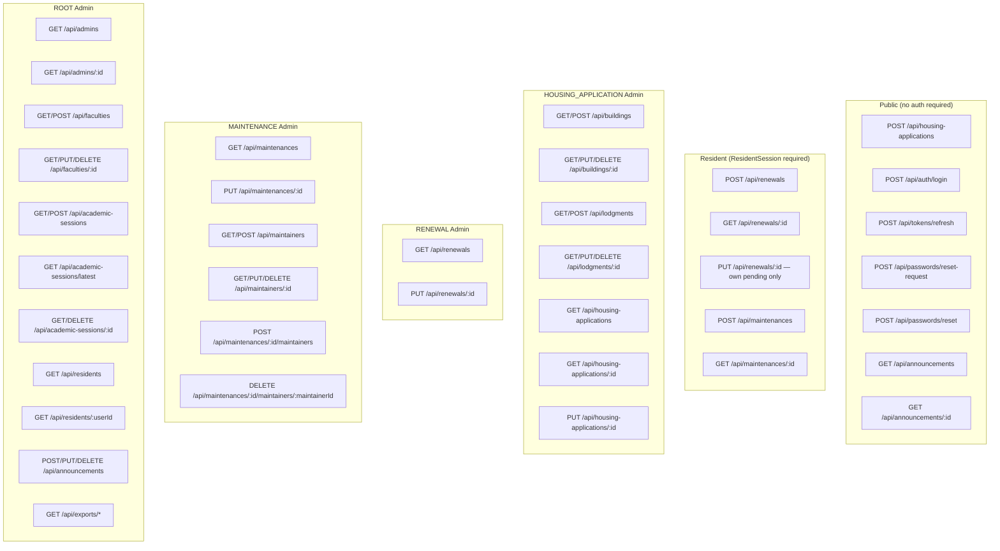
```mermaid
graph TD
    subgraph Public["Public (no auth required)"]
        P1[POST /api/housing-applications]
        P2[POST /api/auth/login]
        P3[POST /api/tokens/refresh]
        P4[POST /api/passwords/reset-request]
        P5[POST /api/passwords/reset]
        P6[GET /api/announcements]
        P7[GET /api/announcements/:id]
    end

    subgraph Resident["Resident (ResidentSession required)"]
        S1[POST /api/renewals]
        S2[GET /api/renewals/:id]
        S3[PUT /api/renewals/:id — own pending only]
        S4[POST /api/maintenances]
        S5[GET /api/maintenances/:id]
    end

    subgraph HousingApplicationAdmin["HOUSING_APPLICATION Admin"]
        RA1[GET/POST /api/buildings]
        RA2[GET/PUT/DELETE /api/buildings/:id]
        RA3[GET/POST /api/lodgments]
        RA4[GET/PUT/DELETE /api/lodgments/:id]
        RA5[GET /api/housing-applications]
        RA6[GET /api/housing-applications/:id]
        RA7[PUT /api/housing-applications/:id]
    end

    subgraph RenewalAdmin["RENEWAL Admin"]
        RN1[GET /api/renewals]
        RN2[PUT /api/renewals/:id]
    end

    subgraph MaintenanceAdmin["MAINTENANCE Admin"]
        MA1[GET /api/maintenances]
        MA2[PUT /api/maintenances/:id]
        MA3[GET/POST /api/maintainers]
        MA4[GET/PUT/DELETE /api/maintainers/:id]
        MA5[POST /api/maintenances/:id/maintainers]
        MA6[DELETE /api/maintenances/:id/maintainers/:maintainerId]
    end

    subgraph RootAdmin["ROOT Admin"]
        RO1[GET /api/admins]
        RO2[GET /api/admins/:id]
        RO3[GET/POST /api/faculties]
        RO4[GET/PUT/DELETE /api/faculties/:id]
        RO5[GET/POST /api/academic-sessions]
        RO6[GET /api/academic-sessions/latest]
        RO7[GET/DELETE /api/academic-sessions/:id]
        RO8[GET /api/residents]
        RO9[GET /api/residents/:userId]
        RO10[POST/PUT/DELETE /api/announcements]
        RO11[GET /api/exports/*]
    end
```

### Real-time Event Flow (Socket.io)

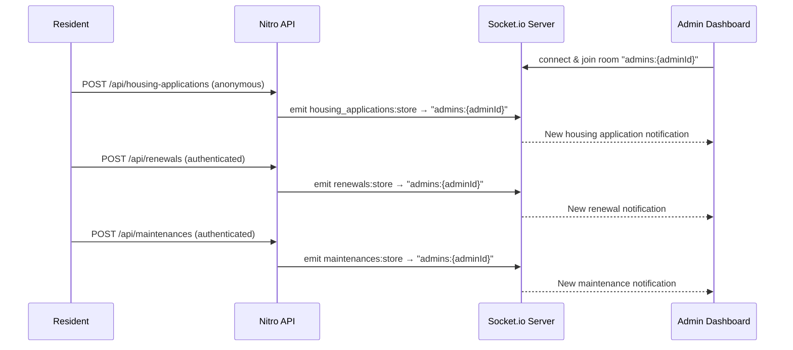
```mermaid
sequenceDiagram
    participant Resident
    participant API as Nitro API
    participant IO as Socket.io Server
    participant Admin as Admin Dashboard

    Admin->>IO: connect & join room "admins:{adminId}"

    Resident->>API: POST /api/housing-applications (anonymous)
    API->>IO: emit housing_applications:store → "admins:{adminId}"
    IO-->>Admin: New housing application notification

    Resident->>API: POST /api/renewals (authenticated)
    API->>IO: emit renewals:store → "admins:{adminId}"
    IO-->>Admin: New renewal notification

    Resident->>API: POST /api/maintenances (authenticated)
    API->>IO: emit maintenances:store → "admins:{adminId}"
    IO-->>Admin: New maintenance notification
```

### Export Capabilities

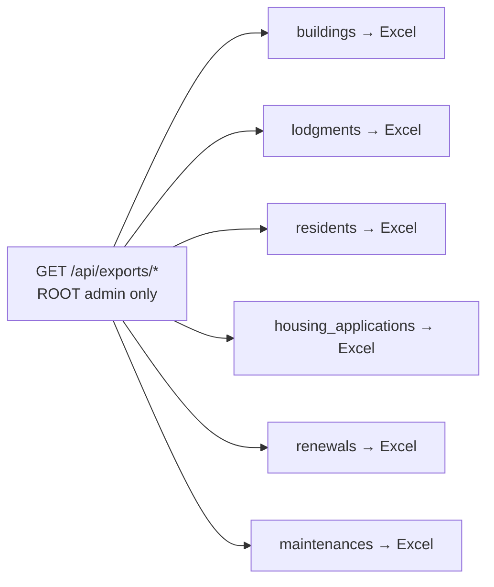
```mermaid
graph LR
    ExportsAPI["GET /api/exports/*\nROOT admin only"] --> E1[buildings → Excel]
    ExportsAPI --> E2[lodgments → Excel]
    ExportsAPI --> E3[residents → Excel]
    ExportsAPI --> E4[housing_applications → Excel]
    ExportsAPI --> E5[renewals → Excel]
    ExportsAPI --> E6[maintenances → Excel]
```
